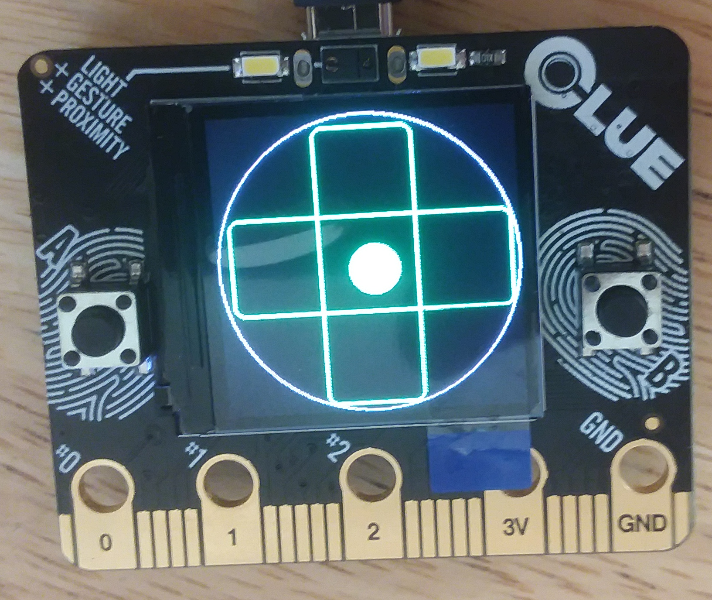
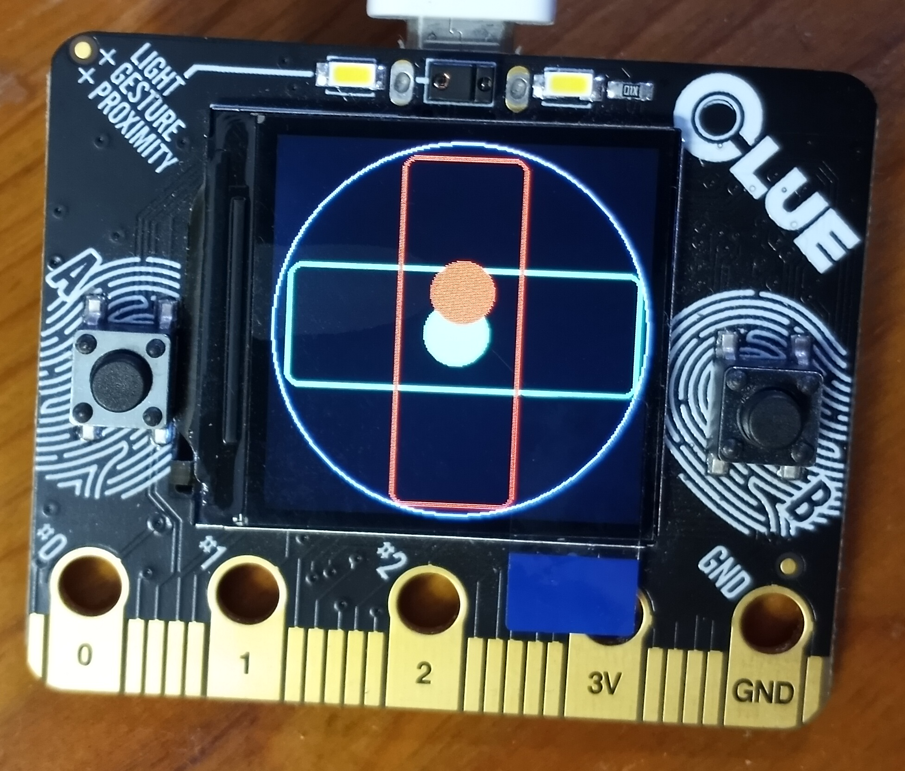

 

# AdaFruit CLUE Double Bubble Level Assignment

## Introducing AdaFruit's Clue

The CLUE from AdaFruit is an adorable little single board development platform based loosely on the BBC's **[micro:bit](https://en.wikipedia.org/wiki/Micro_Bit)** educational board. It runs a nRF52840 supporting Bluetooth Low Energy (BLE). The board is about the size of a half dollar and includes sensors for air pressure, accelerometer, compass, audio, proximity, light, magnetism, buttons, led lights, BLE, and a tiny led screen. It plugs in to a laptop with a USB cable and can be programmed using CircuitPython. Other languages can be used. But CircuitPython is super easy because it's basically just Python. It appears on your laptop like an external USB drive with a file called "code.py" which is a python script. You change that script, save, and it runs. Easy.

That said, the device requires a bit of setup for CircuitPython development. The "code.py" doesn't appear when you first plug it in. You have to first copy a configuration file to it and reboot. You can get the latest version of the file **[here](https://circuitpython.org/board/clue_nrf52840_express/)**. Once you copy the file to the device, it will rename itself "CURCUITPY" and the "code.py" file appears in the finder.

This repo was created as a programming challenge for a friend. I thought it would make a good assignment for a beginner programmer. Feel free to copy or modify it if you find it helpful.

## Double Bubble Level Assignment

1) Clone AdaFruit's **["Spirit Level"](https://learn.adafruit.com/adafruit-clue/clue-spirit-level)** demo project. 
2) Add a second bubble. 
3) Set one bubble to follow the X-axis and the other to follow the Y-axis. 
4) Wrap each bubble in a rectangle forming a cross pattern on the led screen. 
5) Make each bubble and it's corresponding rectangle turn green when the bubble is centered (i.e. level) and red when it is not. 

You can find a working solution in the "code.py" file in this repo. 

 
 

